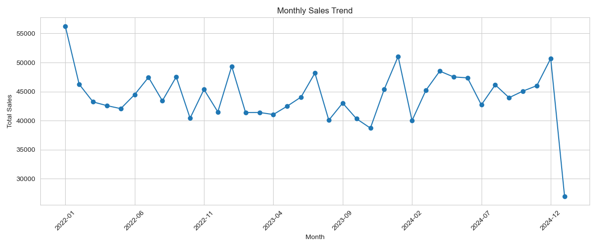
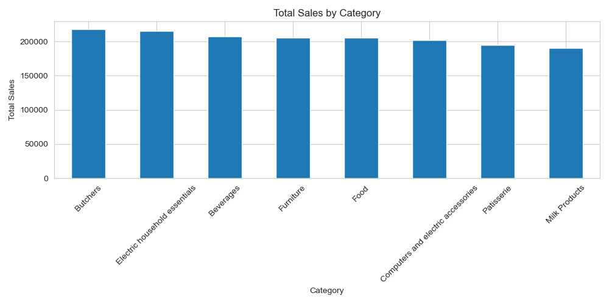
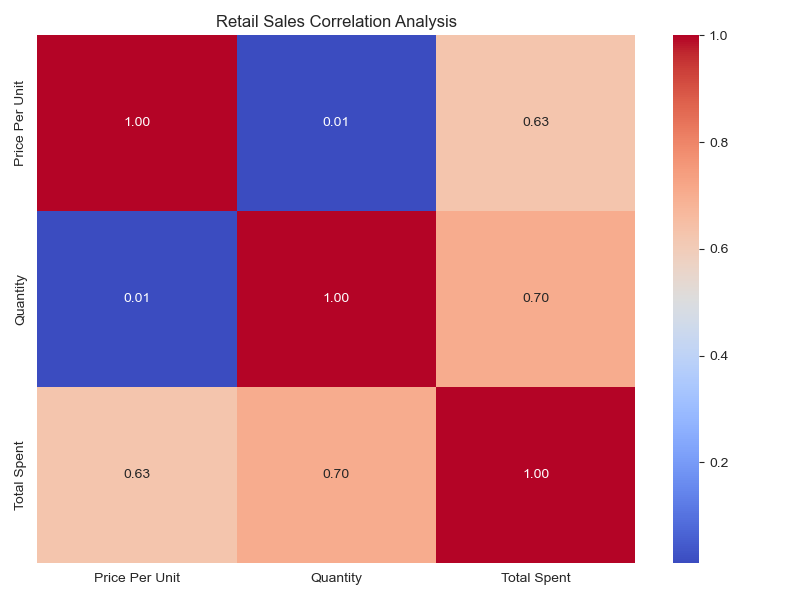
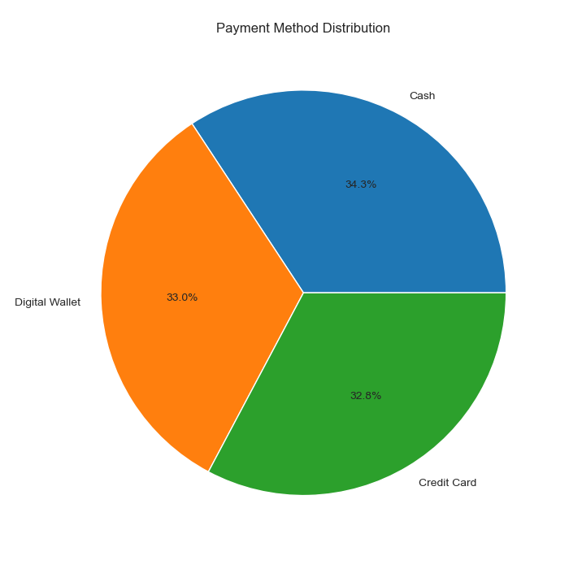
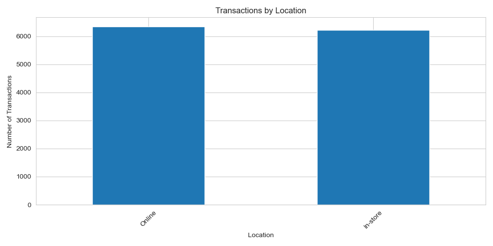
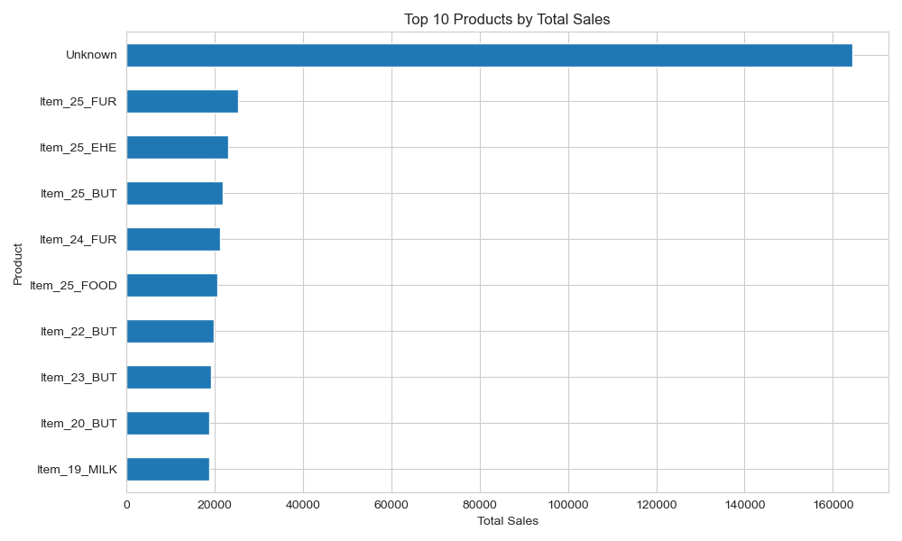
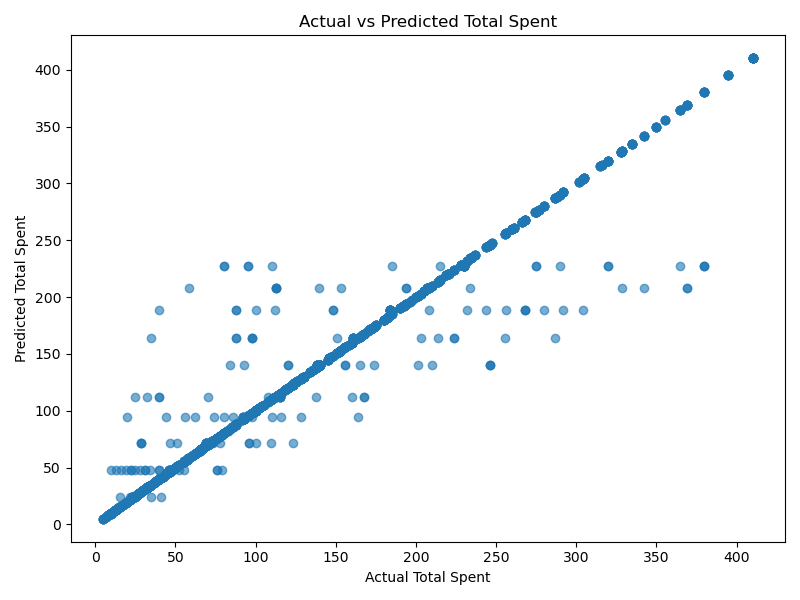
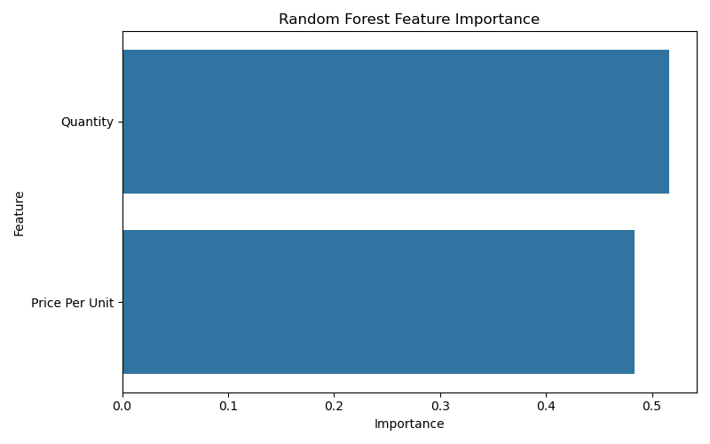

<div align="center">

# 🛒 Retail Store Sales Analytics & Predictive Modeling
### *An End-to-End Data Science Pipeline: From Raw Transactions to Machine Learning Forecasting*

<p align="center">
  
  
  
  
  
  
  
</p>

<p align="center">
  <b>A comprehensive retail analytics and machine learning project uncovering sales trends, customer purchasing behaviors, multi-channel performance, and predicting customer transaction spending with 97% R² accuracy.</b>
</p>

---

</div>

## ⚡ Project at a Glance

<table>
  <tr>
    <td width="25%" align="center">
      <b>📊 Dataset Size</b><br>
      <code>12,575</code> Transactions<br>
      <i>11 Features • 3-Year Span</i>
    </td>
    <td width="25%" align="center">
      <b>💰 Revenue Analyzed</b><br>
      <code>$1,637,367.00</code><br>
      <i>Across 8 Product Categories</i>
    </td>
    <td width="25%" align="center">
      <b>🤖 Predictive Model</b><br>
      <code>Random Forest Regressor</code><br>
      <i>Ensemble Learning (80/20 Split)</i>
    </td>
    <td width="25%" align="center">
      <b>🎯 Model Accuracy</b><br>
      <code>R² = 0.9696</code><br>
      <i>MAE: $3.13 • RMSE: $16.51</i>
    </td>
  </tr>
  <tr>
    <td width="25%" align="center">
      <b>🏆 Top Category</b><br>
      <code>Butchers</code> ($218.1K)<br>
      <i>Followed by Electric Essentials</i>
    </td>
    <td width="25%" align="center">
      <b>💳 Preferred Payment</b><br>
      <code>Cash (34.3%)</code><br>
      <i>Digital (33.0%) • Card (32.8%)</i>
    </td>
    <td width="25%" align="center">
      <b>🌐 Store Channels</b><br>
      <code>Online: 50.5%</code><br>
      <i>In-Store: 49.5% (Omnichannel)</i>
    </td>
    <td width="25%" align="center">
      <b>🔑 Key Spend Driver</b><br>
      <code>Quantity (51.6%)</code><br>
      <i>Price Per Unit (48.4%)</i>
    </td>
  </tr>
</table>

---

## 🔄 End-to-End Data Science Workflow

```
   ┌────────────────────────────────────────────────────────┐
   │                   01. RAW DATA INGESTION               │
   │  • 12,575 Transaction Records  • 11 Attributes         │
   │  • Transaction Dates: Jan 2022 to Jan 2025             │
   └───────────────────────────┬────────────────────────────┘
                               │
                               ▼
   ┌────────────────────────────────────────────────────────┐
   │             02. DATA CLEANING & AUDITING               │
   │  • Datetime Standardization                            │
   │  • Median Imputation for Price & Quantity              │
   │  • Deterministic Total Spent Calculation (P × Q)       │
   │  • Handling Missing Items & Boolean Discounts          │
   └───────────────────────────┬────────────────────────────┘
                               │
                               ▼
   ┌────────────────────────────────────────────────────────┐
   │          03. EXPLORATORY DATA ANALYSIS (EDA)           │
   │  • Revenue & Transaction Volume by Category            │
   │  • Payment Method Share & Omnichannel Split            │
   │  • 36-Month Longitudinal Revenue Trends                │
   │  • Basket Distributions & Outlier Inspection           │
   └───────────────────────────┬────────────────────────────┘
                               │
                               ▼
   ┌────────────────────────────────────────────────────────┐
   │           04. FEATURE & CORRELATION ANALYSIS           │
   │  • Unit Economics Relationship Analysis                │
   │  • Pearson Correlation Matrix (Price, Qty, Spend)      │
   │  • Multi-collinearity & Predictor Screening            │
   └───────────────────────────┬────────────────────────────┘
                               │
                               ▼
   ┌────────────────────────────────────────────────────────┐
   │         05. MACHINE LEARNING MODEL TRAINING            │
   │  • Supervised Regression: Random Forest Regressor      │
   │  • 80/20 Train-Test Partition (10,060 / 2,515 records) │
   │  • Multi-tree Ensemble Learning                        │
   └───────────────────────────┬────────────────────────────┘
                               │
                               ▼
   ┌────────────────────────────────────────────────────────┐
   │             06. RIGOROUS MODEL EVALUATION              │
   │  • R² Score: 0.9696 (~97% Variance Explained)          │
   │  • Mean Absolute Error (MAE): $3.13                    │
   │  • Root Mean Squared Error (RMSE): $16.51              │
   │  • Actual vs. Predicted Validation                     │
   └───────────────────────────┬────────────────────────────┘
                               │
                               ▼
   ┌────────────────────────────────────────────────────────┐
   │           07. BUSINESS INSIGHTS & OUTPUT               │
   │  • Category Revenue Prioritization                     │
   │  • Balanced Payment Infrastructure Strategy            │
   │  • Omnichannel Supply & Inventory Alignment            │
   │  • Export Clean Data, Summary Stats & Predictions      │
   └────────────────────────────────────────────────────────┘
```

---

## 📖 About the Project

### 📌 Problem Statement
In retail operations, understanding what drives customer spend and purchasing behavior is critical for pricing, inventory allocation, and financial planning. Transactional datasets often suffer from missing attributes, inconsistent logging, and complex interactions between basket quantity, price points, and fulfillment channels.

This project addresses these challenges by:
1. **Auditing and Preprocessing** raw, dirty retail transaction data into an analytics-ready warehouse standard.
2. **Conducting Comprehensive EDA** to reveal category performance, seasonal transaction waves, and payment adoption.
3. **Engineering and Training a Machine Learning Model** to accurately predict customer total spending (`Total Spent`) based on transactional characteristics.
4. **Delivering Quantifiable Business Insights** that commercial teams can leverage for operational decision-making.

---

## 🗃️ Dataset Architecture

The project analyzes transaction-level records stored in `Data/Raw/retail_store_sales.csv` and produces cleaned datasets in `Data/cleaned/`.

### 📋 Feature Schema & Data Dictionary

| Column Name | Data Type | Null Count (Raw) | Description | Cleaning Strategy |
| :--- | :--- | :--- | :--- | :--- |
| **`Transaction ID`** | `Object` | 0 | Unique transaction identifier (`TXN_XXXXXXX`) | Verified unique; no missing entries |
| **`Customer ID`** | `Object` | 0 | Unique customer identifier (`CUST_XX`) | Verified consistent format |
| **`Category`** | `Object` | 0 | Departmental category (8 distinct categories) | Validated against master categories |
| **`Item`** | `Object` | 1,213 | Specific SKU purchased | Filled missing values with `"Unknown"` |
| **`Price Per Unit`** | `Float64` | 609 | Retail price per unit in USD ($5.00 – $41.00) | Imputed with category median ($23.00) |
| **`Quantity`** | `Float64` | 604 | Number of units purchased (1.0 – 10.0) | Imputed with distribution median (6.0) |
| **`Total Spent`** | `Float64` | 604 | Total purchase amount in USD ($5.00 – $410.00) | Computed deterministically: `Price × Qty` |
| **`Payment Method`** | `Object` | 0 | Tender used: `Cash`, `Digital Wallet`, `Credit Card` | Categorical normalization |
| **`Location`** | `Object` | 0 | Point-of-sale channel: `Online` vs `In-store` | Verified clean binary channel |
| **`Transaction Date`**| `Datetime64`| 0 | Date of sale (2022-01-01 to 2025-01-19) | Converted from string to datetime |
| **`Discount Applied`**| `Boolean` | 4,199 | Indicator if promotional discount was applied | Imputed missing flags with `False` |

<details>
<summary><b>🔍 View Summary Statistics Table (Click to Expand)</b></summary>
<br>

As generated and exported in `Data/cleaned/eda_summary.csv`:

| Summary Metric | Value |
| :--- | :--- |
| **Total Recorded Transactions** | `12,575` |
| **Total Gross Revenue** | `$1,637,367.00` |
| **Average Order Value (AOV)** | `$130.21` |
| **Average Basket Quantity** | `5.56 units` |
| **Average Price Per Unit** | `$23.35` |
| **Min / Max Unit Price** | `$5.00` / `$41.00` |
| **Min / Max Transaction Spend** | `$5.00` / `$410.00` |

</details>

---

## 📊 Exploratory Data Analysis & Visualizations

Detailed exploratory analysis was conducted across category performance, channel dynamics, payment method distribution, correlation patterns, and longitudinal monthly volume.

### 🖼️ Key Visual Discoveries

<div align="center">

| 36-Month Longitudinal Revenue Trend | Total Revenue by Product Category |
| :---: | :---: |
|  |  |
| *Monthly sales from Jan 2022 to Jan 2025 reveal consistent performance hovering between $40k–$56k/month.* | *Butchers ($218k) and Electric Essentials ($215k) lead total revenue among the 8 categories.* |

| Correlation Matrix Heatmap | Payment Method Distribution |
| :---: | :---: |
|  |  |
| *Strong positive correlation between Quantity and Total Spent (0.70) and Unit Price and Total Spent (0.63).* | *Even distribution across Cash (4,310), Digital Wallets (4,144), and Credit Cards (4,121).* |

| Store Channel Analysis (Online vs In-Store) | Top 10 Products by Total Revenue |
| :---: | :---: |
|  |  |
| *Balanced omnichannel split with 6,354 Online (50.5%) vs 6,221 In-Store (49.5%) orders.* | *High-performing individual product lines demonstrating top retail basket contribution.* |

</div>

<details>
<summary><b>📈 Additional Visualizations Available in Repository (Click to Expand)</b></summary>
<br>

All 28 generated visual artifacts are stored in `visualizations/`:
* `visualizations/eda_average_spending_category.png`: Mean spending comparisons across all departments.
* `visualizations/eda_category_boxplot.png`: Outlier and spread detection across transaction baskets.
* `visualizations/eda_category_transactions.png`: Transaction frequency per retail category.
* `visualizations/eda_discount_analysis.png`: Comparing discount usage across purchase volumes.
* `visualizations/eda_price_quantity.png`: Scatter breakdown of unit price vs transaction quantity.
* `visualizations/eda_quantity_distribution.png`: Histogram and KDE of purchased item quantities.
* `visualizations/eda_total_spent_distribution.png`: Distribution profile of customer total spend.

</details>

---

## 🤖 Predictive Machine Learning Modeling

A supervised machine learning model was developed to predict **`Total Spent`** per customer transaction based on unit economics (`Price Per Unit` and `Quantity`).

### ⚙️ Model Architecture & Experimental Setup
* **Algorithm**: **Random Forest Regressor** (Ensemble of bagged decision trees)
* **Features Selected ($X$)**: 
  1. `Price Per Unit` (Continuous numeric variable)
  2. `Quantity` (Discrete numeric variable)
* **Target Variable ($y$)**: `Total Spent` (Continuous dollar amount)
* **Dataset Partition**:
  * **Training Set**: `80%` (10,060 samples)
  * **Testing Set**: `20%` (2,515 samples)
* **Rationale**: Random Forest captures non-linear relationships, resists overfitting via bootstrap aggregation, and provides feature importance coefficients.

<div align="center">

| Actual vs. Predicted Total Spent | Random Forest Feature Importance |
| :---: | :---: |
|  |  |
| *Predictions closely align along the 45-degree ideal fit line, proving tight variance control.* | *Quantity (51.63%) and Unit Price (48.37%) contribute nearly equally to spend prediction.* |

</div>

---

## 📈 Model Performance & Evaluation

The predictive model was rigorously evaluated on the unseen 2,515 test transactions using standard regression metrics:

<table>
  <thead>
    <tr>
      <th>Evaluation Metric</th>
      <th>Formula / Definition</th>
      <th>Observed Score</th>
      <th>Business Interpretation</th>
    </tr>
  </thead>
  <tbody>
    <tr>
      <td><b>R² Score (Coefficient of Determination)</b></td>
      <td><code>1 - (SS_res / SS_tot)</code></td>
      <td><b>0.9696 (96.96%)</b></td>
      <td>The model successfully explains <b>~97% of the total variance</b> in customer spend.</td>
    </tr>
    <tr>
      <td><b>Mean Absolute Error (MAE)</b></td>
      <td><code>(1/n) Σ |y - ŷ|</code></td>
      <td><b>$3.13</b></td>
      <td>On average, predicted customer receipts deviate by only <b>$3.13</b> from actual spend.</td>
    </tr>
    <tr>
      <td><b>Mean Squared Error (MSE)</b></td>
      <td><code>(1/n) Σ (y - ŷ)²</code></td>
      <td><b>272.70</b></td>
      <td>Quantifies variance penalty for occasional larger deviations.</td>
    </tr>
    <tr>
      <td><b>Root Mean Squared Error (RMSE)</b></td>
      <td><code>√MSE</code></td>
      <td><b>$16.51</b></td>
      <td>Standard error of residuals in the original dollar currency unit.</td>
    </tr>
  </tbody>
</table>

### 🔍 Feature Importance Breakdown
```
  Quantity         ██████████████████████████████  51.63% (0.5163)
  Price Per Unit   ████████████████████████████    48.37% (0.4837)
```
> Both variables share balanced importance, confirming that basket size and item tier both play critical roles in defining receipt magnitude.

---

## 💡 Key Business Insights

Based on empirical data from the 12,575 transactions, the following insights were derived:

1. **Category Revenue Leaders**:
   * **Butchers** ($218,153.00) and **Electric household essentials** ($215,297.50) represent the highest revenue-generating sectors, closely followed by **Beverages** ($206,854.50) and **Furniture** ($205,390.00).
   * High-tier unit items in electronics combined with steady volume in fresh food anchor overall store profitability.

2. **True Omnichannel Equilibrium**:
   * Transactions are divided near-equally between **Online (50.5% / 6,354)** and **In-store (49.5% / 6,221)**.
   * Retailers must maintain unified inventory visibility and pricing parity across both digital and physical storefronts.

3. **Even Payment Preference Distribution**:
   * Customer payment methods are remarkably balanced: **Cash (34.3% / 4,310)**, **Digital Wallet (33.0% / 4,144)**, and **Credit Card (32.8% / 4,121)**.
   * Eliminating payment friction across all three rails is mandatory to avoid checkout drop-offs.

4. **Basket Economics & Inelasticity**:
   * The correlation between `Price Per Unit` and `Quantity` is virtually zero ($r = 0.011$).
   * This indicates that customers do not significantly reduce unit quantities when purchasing higher-priced items in this store, suggesting pricing power on premium SKUs.

5. **Machine Learning Feasibility**:
   * Achieving an **$R^2$ of 0.9696** confirms that customer transaction totals can be accurately estimated in real time, supporting instant receipt auditing, automated basket checkout, and dynamic promotional budgeting.

---

## 🧰 Tech Stack & Tools

<table>
  <tr>
    <td align="center" width="20%"><b>Language & Env</b></td>
    <td>
      
      
      
    </td>
  </tr>
  <tr>
    <td align="center" width="20%"><b>Data Wrangling</b></td>
    <td>
      
      
    </td>
  </tr>
  <tr>
    <td align="center" width="20%"><b>Data Visualization</b></td>
    <td>
      
      
    </td>
  </tr>
  <tr>
    <td align="center" width="20%"><b>Machine Learning</b></td>
    <td>
      
      
    </td>
  </tr>
  <tr>
    <td align="center" width="20%"><b>Version Control</b></td>
    <td>
      
      
    </td>
  </tr>
</table>

---

## 📁 Repository Structure

```text
Retail-Store-Sales-Data Science/
│
├── Data/
│   ├── Raw/
│   │   └── retail_store_sales.csv            # 12,575 raw transaction records
│   └── cleaned/
│       ├── retail_store_sales_cleaned.csv    # Cleaned & imputed transaction dataset
│       ├── eda_summary.csv                   # Core statistical metrics summary
│       └── model_predictions.csv             # Test actual vs predicted spending
│
├── Data cleaning and visualization/
│   └── Retail_Store_sales_data.ipynb         # Data auditing, cleaning, and preliminary charts
│
├── Exploratory data analysis/
│   └── exploratory_data_analysis.ipynb       # Deep-dive statistical and visual EDA
│
├── Predictive Modeling/
│   └── predictive_modeling.ipynb             # Random Forest training, evaluation & metrics
│
├── Real World Project/
│   └── Retail_Store_Real_World_Analysis.ipynb# End-to-end integrated production notebook
│
├── visualizations/                           # 28 exported high-resolution figures (.png)
│   ├── actual_vs_predicted.png
│   ├── correlation_heatmap.png
│   ├── feature_importance.png
│   ├── real_world_monthly_sales.png
│   ├── real_world_sales_by_category.png
│   ├── real_world_payment_method.png
│   ├── real_world_location.png
│   └── ... (21 additional chart exports)
│
└── README.md                                 # Project documentation
```

---

## 🚀 How to Run & Reproduce

Follow these simple steps to replicate the complete analysis and modeling environment locally.

### 1️⃣ Clone the Repository
```bash
git clone https://github.com/mmsameer2006/Retail-Store-Data-Science.git
cd Retail-Store-Data-Science
```

### 2️⃣ Create & Activate a Virtual Environment
```bash
# On Windows
python -m venv venv
venv\Scripts\activate

# On macOS/Linux
python3 -m venv venv
source venv/bin/activate
```

### 3️⃣ Install Required Dependencies
```bash
pip install pandas numpy matplotlib seaborn scikit-learn jupyter
```

### 4️⃣ Launch the Notebooks
```bash
jupyter notebook
```
Execute the notebooks in logical sequence:
1. `Data cleaning and visualization/Retail_Store_sales_data.ipynb` — Data ingestion and cleaning.
2. `Exploratory data analysis/exploratory_data_analysis.ipynb` — In-depth statistical analysis.
3. `Predictive Modeling/predictive_modeling.ipynb` — Machine learning model training and evaluation.
4. `Real World Project/Retail_Store_Real_World_Analysis.ipynb` — Complete end-to-end pipeline.

---

## 🔮 Future Improvements & Roadmap

The project lays a solid foundation for enterprise retail analytics. Planned enhancements include:
* [ ] **Customer Segmentation (RFM Analysis)**: Grouping shoppers by Recency, Frequency, and Monetary value.
* [ ] **Multi-Model Benchmarking**: Evaluating Ridge, Gradient Boosting (XGBoost / LightGBM), and Neural Networks against Random Forest.
* [ ] **Hyperparameter Optimization**: Systematic tuning using `GridSearchCV` or Bayesian Optimization.
* [ ] **Time-Series Forecasting**: Forecasting category demand using ARIMA or Prophet models.
* [ ] **Interactive Web Deployment**: Packaging the model into a **Streamlit** dashboard or **Power BI** live report.

---

## 👨‍💻 Author

<div align="center">

**M Mohamed Sameer**  
*Aspiring Data Analyst / Data Scientist*

[](https://linkedin.com)
[](https://github.com/mmsameer2006)
[](https://github.com/mmsameer2006)

*Passionate about turning transactional data into actionable business intelligence.*

</div>

---

<div align="center">
  <sub>⭐ Found this repository helpful? Give it a star on GitHub!</sub>
</div>
